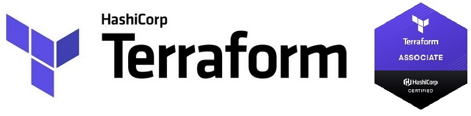

<br>

# Terraform 0.13+ Lessons fulfilled by Dmitry Yemelin

### Set AWS Credentials in Windows PowerShell:

```
$env:AWS_ACCESS_KEY_ID="insert your AWS access key ID"
$env:AWS_SECRET_ACCESS_KEY="insert your AWS access key"
$env:AWS_DEFAULT_REGION="us-east-1"
```

### Set AWS Credentials in Linux Shell:

```
export AWS_ACCESS_KEY_ID="insert your AWS access key ID"
export AWS_SECRET_ACCESS_KEY="insert your AWS access key"
export AWS_DEFAULT_REGION="us-east-1"
```

### Terraform Commands

```
terraform init
terraform plan
terraform apply
terraform destroy

terraform show
terraform output
terraform console
terraform import
terraform taint
```

### Terraform State Commands

```
terraform state show
terraform state list
terraform state pull
terraform state rm
terraform state mv
terraform state push
```

`for x in $(terraform state list | grep xyz); do terraform state mv -state-out=”terraform.tfstate” $x $x; done`

### Terraform Workspace Commands

```
terraform workspace show
terraform workspace list
terraform workspace new
terraform workspace select
terraform workspace delete
```

`${terraform.workspace}`
